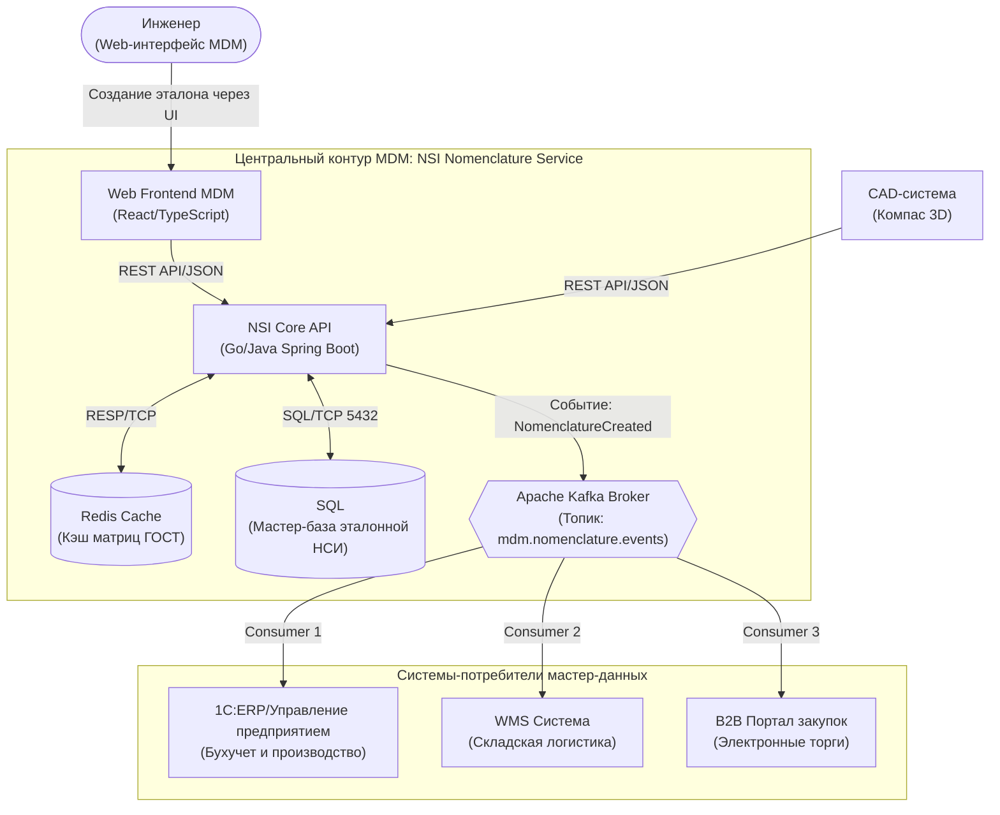

# Архитектурная модель C4: Диаграмма контейнеров

## 1. Назначение системы
Микросервис **"NSI Nomenclature Service"** предназначен для централизованной валидации, сборки нормализованных наименований стандартизированных изделий (пилотная группа метизов) по правилам ГОСТ и их асинхронного распространения в корпоративном IT-ландшафте.

## 2. Диаграмма контейнеров

## 3. Спецификация компонентов и интерфейсов

| Компонент | Стек технологий | Протокол / Порт | Назначение и зона ответственности |
| :--- | :--- | :--- | :--- |
| **Web Frontend MDM** | React, TypeScript | HTTPS/443 | Пользовательский интерфейс инженера: интерактивный Мастер-фильтр параметров. |
| **CAD** | C# (API Компас) | HTTPS/443 | Внешний клиент: пакетная передача конструкторских спецификаций в NSI API. |
| **NSI Core API** | Go/Java Spring Boot | HTTP/JSON / 8080 | Ядро сервиса: валидация по ГОСТ, дедупликация, сборка условных обозначений, отправка событий в Kafka. |
| **SQL** | Реляционная СУБД | TCP/5432 | Персистентное хранилище эталонной НСИ в 3НФ, функциональные индексы поиска дублей, транзакционная целостность. |
| **Redis** | In-Memory Key-Value | RESP/TCP / 6379 | Кэширование отфильтрованных матриц параметров со стратегией TTL 24h для снижения нагрузки на БД. |
| **Apache Kafka Broker** | Distributed Event Streaming | TCP/9092 | Шина событий. Топик `mdm.nomenclature.events` для асинхронного вещания подписчикам. |
| **1C:ERP Consumer** | 1С:Предприятие (Фоновое задание) | Kafka Protocol/TCP | Потребитель: вычитывает событие из Kafka и фиксирует эталонную позицию в справочниках 1С:ERP для бухучета. |
| **WMS Consumer** | Go/Python Daemon | Kafka Protocol/TCP | Потребитель: создает карточку товара в складской системе для адресного хранения и штрихкодирования. |
| **B2B Portal Consumer**| Node.js/Java Service | Kafka Protocol/TCP | Потребитель: обновляет номенклатурный справочник на электронной торговой площадке для проведения тендеров. |
