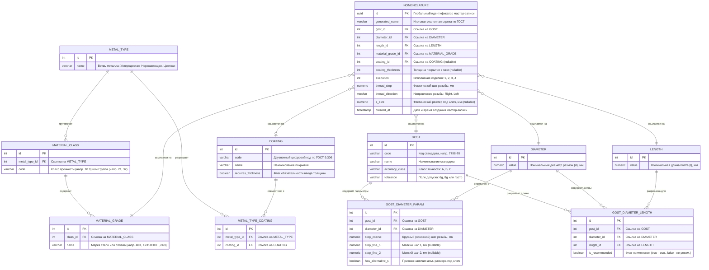

# Реляционная модель данных

## 1. Архитектурные принципы проектирования БД
База данных сервиса спроектирована с учетом следующих требований:

1. **Третья нормальная форма:** Все неключевые атрибуты функционально зависят исключительно от первичных ключей, что исключает аномалии обновления и дублирование справочных данных.

2. **Ссылочная целостность:** Все связи между матрицами ограничений и справочниками защищены внешними ключами с правилом `ON DELETE RESTRICT`.

3. **Хранение атомарных параметров:** В транзакционную таблицу `NOMENCLATURE` сохраняется не только итоговая строка, но и внешние ключи на все выбранные физические параметры изделия для возможности последующей аналитики в ERP/WMS.

## 2. ER-диаграмма



## 3. Словарь данных

| Таблица | Назначение | Тип сущности |
| :--- | :--- | :--- |
| **`GOST`** | Реестр стандартов ГОСТ на крепежные изделия с базовыми параметрами. | Справочник |
| **`DIAMETER`** | Ряд номинальных диаметров метрической резьбы (d). | Справочник |
| **`LENGTH`** | Ряд номинальных длин болтов (l). | Справочник |
| **`GOST_DIAMETER_PARAM`** | Матрица соответствия стандартов, диаметров, основных и мелких шагов. | Таблица связей |
| **`GOST_DIAMETER_LENGTH`**| Матрица допустимых длин для каждого диаметра в разрезе стандарта. | Таблица связей |
| **`METAL_TYPE`** | Базовые ветви металлов (Углеродистая сталь, Нержавеющая сталь, Цветные сплавы). | Классификатор |
| **`MATERIAL_CLASS`** | Классы прочности углеродистых сталей и группы материалов сплавов. | Справочник |
| **`MATERIAL_GRADE`** | Перечень конкретных марок сталей и сплавов, разрешенных для классов/групп. | Справочник |
| **`COATING`** | Классификатор видов защитных покрытий по ГОСТ 9.306-85. | Справочник |
| **`METAL_TYPE_COATING`** | Матрица совместимости защитных покрытий с ветвями металлов. | Таблица связей |
| **`NOMENCLATURE`** | Реестр сформированных мастер-записей номенклатуры. | Транзакционная таблица |

## 4. Индексная стратегия

Для обеспечения высокой скорости поиска и исключения создания дубликатов на таблицу `NOMENCLATURE` накладываются следующие индексы:

1. **B-Tree Unique Index:**
   * `idx_nomenclature_unique_params` – составной уникальный индекс по физическим параметрам: `(gost_id, diameter_id, length_id, material_grade_id, COALESCE(coating_id, 0), COALESCE(coating_thickness, 0), execution, thread_step, thread_direction, COALESCE(s_size, 0))`.
2. **Functional Index (Нормализация исторических опечаток):**
   * `idx_nomenclature_normalized_name` – функциональный индекс по текстовому выражению:
     ```sql
     CREATE UNIQUE INDEX idx_nomenclature_normalized_name 
     ON NOMENCLATURE (LOWER(REPLACE(generated_name, 'x', '×')));
     ```
     Индекс гарантирует уникальность наименования вне зависимости от того, какой символ умножения (латинский `x` или типографский `×`) использовался при ручном вводе в смежных системах.
