# Алгоритм генерации и валидации наименований

## 1. Назначение алгоритма
Схема описывает программную логику микросервиса NSI Core API при обработке запроса `POST /api/v1/nomenclature/generate`. Алгоритм обеспечивает детерминированную сборку условного обозначения метиза, валидацию комбинаций параметров по стандартам ГОСТ, контроль уникальности и инициацию асинхронного события.

## 2. Блок-схема алгоритма

```mermaid
flowchart TD
    Start(["Получение POST /api/v1/nomenclature/generate"]) --> Parse["Парсинг JSON payload и извлечение ID параметров"]
    
    Parse --> CheckGost{"Выбран ГОСТ 15589-70?"}
    CheckGost -->|Да: Класс С| TolEmpty["Стр_Допуск = ''"]
    CheckGost -->|Нет: Класс А, В| Tol6g["Стр_Допуск = '-6g'"]
    
    TolEmpty --> Exec{"Исполнение == 1?"}
    Tol6g --> Exec
    
    Exec -->|Да: Основное| ExecEmpty["Стр_Исполнение = ''"]
    Exec -->|Нет: 2, 3, 4| ExecVal["Стр_Исполнение = Значение (напр. '2')"]
    
    ExecEmpty --> Pitch{"Шаг резьбы"}
    ExecVal --> Pitch
    
    Pitch -->|Крупный / Основной| PitchEmpty["Стр_Шаг = ''"]
    Pitch -->|Мелкий| PitchVal["Стр_Шаг = '×' + Значение (напр. '×1.25')"]
    
    PitchEmpty --> Dir{"Направление резьбы"}
    PitchVal --> Dir
    
    Dir -->|Правая| DirEmpty["Стр_Направление = ''"]
    Dir -->|Левая| DirLH["Стр_Направление = '-LH'"]
    
    DirEmpty --> SSize{"Размер под ключ S"}
    DirLH --> SSize
    
    SSize -->|Основной / Безальтернативный| SEmpty["Стр_Размер = ''"]
    SSize -->|Альтернативный| SVal["Стр_Размер = ' (S' + Значение + ')'"]
    
    SEmpty --> Mat{"Ветвь металла"}
    SVal --> Mat
    
    Mat -->|Углеродистая сталь| CarbClass{"Класс прочности >= 8.8?"}
    CarbClass -->|Да| CarbHigh["Стр_Материал = '.' + КлассБезТочки + '.' + МаркаСтали"]
    CarbClass -->|Нет| CarbLow["Стр_Материал = '.' + КлассБезТочки + опционально '.' + Марка/Раскисление"]
    
    Mat -->|Нержавеющая сталь| StainSys{"Система стандартов"}
    StainSys -->|ГОСТ 1759.0| StainGost["Стр_Материал = '.' + Группа + '.' + Марка"]
    StainSys -->|ISO 3506-1| StainISO["Стр_Материал = '.' + Марка + '-' + Класс"]
    
    Mat -->|Цветные сплавы| Color["Стр_Материал = '.' + Группа + '.' + Марка"]
    
    CarbHigh --> Coat{"Наличие защитного покрытия"}
    CarbLow --> Coat
    StainGost --> Coat
    StainISO --> Coat
    Color --> Coat
    
    Coat -->|Без покрытия| CoatEmpty["Стр_Покрытие = ''"]
    Coat -->|С покрытием| CoatThick{"Требует указания толщины? (Исключая 05, 06, 11)"}
    
    CoatThick -->|Да| CoatVal["Стр_Покрытие = '.' + Код + Толщина"]
    CoatThick -->|Нет| CoatCode["Стр_Покрытие = '.' + Код"]
    
    CoatEmpty --> Concat
    CoatVal --> Concat
    CoatCode --> Concat
    
    Concat["Сборка строки:<br/>'Болт ' + Стр_Исполнение + 'М' + d + Стр_Шаг + Стр_Направление + Стр_Допуск + '×' + l + Стр_Материал + Стр_Покрытие + Стр_Размер + ' ' + ГОСТ"] --> CheckDB{"Поиск дубликата в SQL:<br/>SELECT id FROM NOMENCLATURE<br/>WHERE LOWER(REPLACE(generated_name, 'x', '×')) = ..."}
    
    CheckDB -->|Запись найдена: count > 0| Err["Формирование ответа: HTTP 409 Conflict<br/>(Возврат ID существующего дубликата)"]
    CheckDB -->|Запись уникальна: count == 0| Save[("Транзакция БД:<br/>INSERT INTO NOMENCLATURE (...)")]
    
    Save --> Kafka["Публикация события в Kafka:<br/>Topic: mdm.nomenclature.events<br/>Event: NomenclatureCreated"]
    Kafka --> Success["Формирование ответа: HTTP 201 Created<br/>(Возврат сгенерированного UUID и эталонной строки)"]
```

## 3. Матрица синтаксических правил склейки

| Сегмент обозначения | Условие исключения (пустая строка `""`) | Формат при наличии значения | Пример вывода |
| :--- | :--- | :--- | :--- |
| **Исполнение** | Исполнение 1 | Цифра исполнения перед литерой «М» | `2М12` |
| **Шаг резьбы** | Крупный (основной) шаг | `×` + числовое значение | `×1.25` |
| **Направление резьбы** | Правая резьба | `-LH` | `-LH` |
| **Поле допуска** | ГОСТ 15589-70 (Класс точности С) | `-6g` (для ГОСТ 7805-70 и 7798-70) | `-6g` |
| **Размер под ключ** | Основной размер (или безальтернативный) | Пробел + `(S` + размер + `)` | ` (S18)` |
| **Материал (Сталь)** | Класс < 8.8 без указания марки | `.` + класс без точки + `.` + марка | `.109.40Х` |
| **Материал (ISO)** | — | `.` + марка + `-` + класс прочности | `.А2-70` |
| **Покрытие** | Без покрытия | `.` + 2-значный код + толщина | `.0115`, `.05` |
