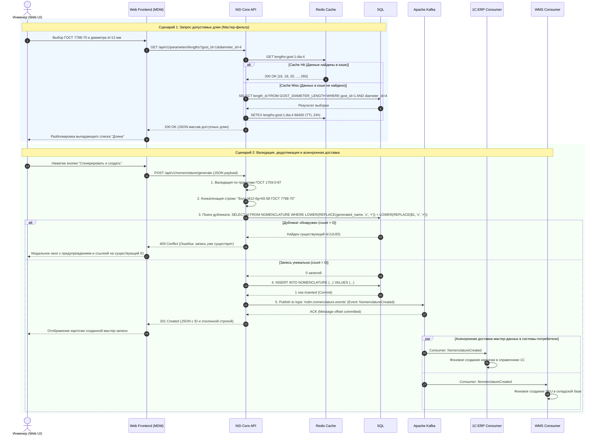

# Диаграмма последовательности: Интеграционные сценарии

## 1. Назначение документа

Документ описывает два ключевых сквозных сценария взаимодействия компонентов микросервиса NSI Nomenclature Service:

### 1. Сценарий чтения: Динамическая фильтрация параметров на форме с применением двухуровневого доступа (Redis Cache → SQL).

### 2. Сценарий записи: Валидация входных данных, дедупликация, транзакционная фиксация в БД и асинхронное вещание мастер-записи подписчикам через Apache Kafka.

## 2. Диаграмма последовательности

## 3. Детализация механизмов отказоустойчивости
### 1. Кэширование со стратегией Cache-Aside:
* Сервис проверяет ключ в Redis. При отсутствии данных выполняется обращение к SQL с последующим заполнением кэша с временем жизни TTL = 86400 сек (24 часа).
### 2. Дедупликация и нормализация "на лету":
* Проверка уникальности использует SQL-функцию REPLACE для приведения символов умножения к стандарту × (U+00D7), что предотвращает создание дублей при наличии исторических опечаток в базах-потребителях.
### 3. Гарантия доставки сообщений:
* Публикация в Kafka выполняется только после успешного коммита транзакции в SQL (INSERT).
Подтверждение от брокера Kafka гарантирует репликацию события в кластере до возврата ответа 201 Created пользователю.
